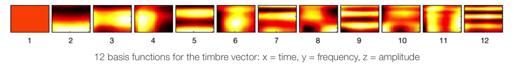

```{r, echo = FALSE}
knitr::opts_chunk$set(
  fig.path = "README_figs/README-"
)
```

```{r setup, include=FALSE}
library(flexdashboard)
library(spotifyr)
library(tidyverse)
library(plotly)
source('Spotify.R')
library(compmus)
library(ggpubr)
library(rmarkdown)
library(tidymodels)
library(protoclust)
library(ggdendro)
library(heatmaply)
```

```{r datasets}

knopfler <- get_artist_audio_features(artist = "Mark Knopfler")
direstraits <- get_artist_audio_features(artist = "Dire Straits")
combined <- 
  knopfler %>% bind_rows(direstraits)

knopfler2 <-
  get_playlist_audio_features('Mark Knopfler', '7Fx4RkUA16c1sf56GqDLNi') %>% slice(1:115) %>% add_audio_analysis()
direstraits2 <-
  get_playlist_audio_features('Dire Straits', '4De4uI5PG0MYqLftPmsQLW') %>% add_audio_analysis()
combined2 <- knopfler2 %>% mutate(Artist = "Mark Knopfler") %>% bind_rows(direstraits2 %>% mutate(Artist = "Dire Straits"))

investigations <- 
  get_tidy_audio_analysis('5KVak7r5YKcnkmARc0hy0Q') %>% 
    select(segments) %>% unnest(segments) %>% 
    select(start, duration, pitches)

sos <- 
    get_tidy_audio_analysis('37Tmv4NnfQeb0ZgUC4fOJj') %>% 
    compmus_align(bars, segments) %>% 
    select(bars) %>% unnest(bars) %>% 
    mutate(
        pitches = 
            map(segments, 
                compmus_summarise, pitches, 
                method = 'rms', norm = 'chebyshev')) %>% 
    mutate(
        timbre = 
            map(segments, 
                compmus_summarise, timbre, 
                method = 'rms', norm = 'euclidean'))

wii <- 
    get_tidy_audio_analysis('65f8Ca4HbZCMLhpZPTHW4O') %>% 
    compmus_align(bars, segments) %>% 
    select(bars) %>% unnest(bars) %>% 
    mutate(
        pitches = 
            map(segments, 
                compmus_summarise, pitches, 
                method = 'rms', norm = 'chebyshev')) %>% 
    mutate(
        timbre = 
            map(segments, 
                compmus_summarise, timbre, 
                method = 'rms', norm = 'euclidean'))

neworleans <- get_tidy_audio_analysis('4TUC13vLPzZCFSKe5JOJD5')

knopfler3 <-
  get_playlist_audio_features('Mark Knopfler', '7Fx4RkUA16c1sf56GqDLNi') %>% slice(1:80) %>% add_audio_analysis()
direstraits3 <-
  get_playlist_audio_features('Dire Straits', '4De4uI5PG0MYqLftPmsQLW') %>% slice(1:80) %>% add_audio_analysis()

combined3 <-
  knopfler3 %>% mutate(Artist = "Mark Knopfler") %>%
  bind_rows(
    direstraits3 %>% mutate(Artist = "Dire Strats")) %>%
  mutate(Artist = factor(Artist)) %>%
  mutate(
        segments = 
            map2(segments, key, compmus_c_transpose)) %>% 
    mutate(
        pitches = 
            map(segments, 
                compmus_summarise, pitches, 
                method = 'mean', norm = 'manhattan'),
        timbre =
            map(
                segments,
                compmus_summarise, timbre,
                method = 'mean')) %>% 
    mutate(pitches = map(pitches, compmus_normalise, 'clr')) %>% 
    mutate_at(vars(pitches, timbre), map, bind_rows) %>% 
    unnest(cols = c(pitches, timbre))

artist_class <-
  recipe(Artist ~
               danceability +
               energy +
               loudness +
               speechiness +
               acousticness +
               instrumentalness +
               liveness +
               valence +
               tempo +
               duration +
               C + `C#|Db` + D + `D#|Eb` +
               E + `F` + `F#|Gb` + G +
               `G#|Ab` + A + `A#|Bb` + B +
               c01 + c02 + c03 + c04 + c05 + c06 +
               c07 + c08 + c09 + c10 + c11 + c12,
           data = combined3) %>% 
    step_center(all_predictors()) %>%
    step_scale(all_predictors()) %>%
    prep(combined3) %>% 
    juice

artist_cv <- artist_class %>% vfold_cv(10)

artist_knn <-
  nearest_neighbor(mode = 'classification', neighbors = 13) %>%
  set_engine('kknn')
predict_knn <- function(split)
  fit(artist_knn, Artist ~ ., data = analysis(split)) %>%
  predict(assessment(split), type = 'class') %>%
  bind_cols(assessment(split))

forest <- 
    rand_forest(mode = 'classification') %>% 
    set_engine('randomForest')
predict_forest <- function(split)
    fit(forest, Artist ~ ., data = analysis(split)) %>% 
    predict(assessment(split), type = 'class') %>%
    bind_cols(assessment(split))

predict_knn_reduced <- function(split)
    fit(
        artist_knn, 
        Artist ~ instrumentalness + loudness + energy + duration + acousticness + valence, 
        data = analysis(split)) %>% 
    predict(assessment(split), type = 'class') %>%
    bind_cols(assessment(split))

```

### 7. R has no problem distinguishing between Dire Straits and Mark Knopfler{data-commentary-width=450}

```{r 7}


artist_cv %>%
  mutate(pred = map(splits, predict_knn)) %>% unnest(pred) %>%
  conf_mat(truth = Artist, estimate = .pred_class) %>%
  autoplot(type = 'mosaic')

```

***

Clearly, R has no problem distinguishing between the two artists. When using an even larger number for k, it relatively has the most difficulty recognising music by Mark Knopfler. This could have something to do with the fact that Mark Knopfler's music seemed to be more diverse in previous experiments. This would mean that R recognises "The Dire Straits sound" and labels everything that isn't it as music by Mark Knopfler, mislabeling music by Mark Knopfler that conforms to this specific sound.

I have used k = 13 for this experiment, since this is the square root of the size of the corpus rounded off to an odd number, which is the standard for knn algorithms according to google. The algorithm seemed to have the best results with k = 20, but this seemed to be quite extreme and that could hide some trends when looked into further.


```{r 7x}

artist_cv %>% 
    mutate(pred = map(splits, predict_knn)) %>% unnest(pred) %>% 
    metric_set(accuracy, kap, j_index)(truth = Artist, estimate = .pred_class)

```

### 8. R recognises Dire Straits because of its instrumentalness, loudness, energy, valence, acousticness and duration{data-commentary-width=450}

```{r 8}

artist_class %>% 
    fit(forest, Artist ~ ., data = .) %>% 
    pluck('fit') %>% 
    randomForest::varImpPlot()

```


***

Wow. I did not expect that. 

Although acousticness does bear some weight in the desicion, the loudness seems to be much more important for R. Although the real differentiator seems to be instrumentalness, a parameter which thusfar has largely remained unnoticed. This could actually very well attribute to the lesser success of Mark Knopfler as a solo musician, since instrumental music tends to be less popular, especially if it's non-electronic. However, these parameters do not tend to harvest better results in a knn model, although they are still relatively accurate:

```{r 8x}

artist_cv %>% 
    mutate(pred = map(splits, predict_knn_reduced)) %>% unnest(pred) %>% 
    metric_set(accuracy, kap, j_index)(truth = Artist, estimate = .pred_class)

```

The most obvious conclusion that can be drawn from this is that the two artists are in fact *very* different, which is why R has no problem distinguishing between the two on the basis of whatever parameters we give it. In my conclusion I will plot the parameters that R has deemed most relevant (instrumentalness, energy and duration) to determine just how they are different for both artists. I have omitted loudness since that parameter is relative to acousticness (see page 2).

### 9. Conclusions and discussion {data-commentary-width=350}

```{r conclusion}

conclusion <- ggplot(combined3, 
                     aes(
                       x = duration, 
                       y = instrumentalness, 
                       size = energy,
                       col = Artist, label = track.name)) +
  geom_point(alpha = 0.8)+
  theme_classic() +
  labs(color = "Artist", title = "Clearest difference between Mark Knopfler and Dire Straits according to R", size = "Energy", x = "Duration", y = "Instrumentalness")

ggplotly(conclusion)

```

***

*What are the fundamental differences between Mark Knopfler's music with Dire Straits and as a solo musician?*

The first conclusion I was able to draw was that Mark Knopfler makes more timbrally diverse music for his solo career. This diversity has an effect on loudness, since certain timbres have the tendency to decay quickly (MFCC c04) which result in a lower loudness rating.

However, R has made some other discoveries that I didn't pick up on when exploring the data:

1. Mark Knopfler tends to write shorter songs for his solo project. An obvious outlier in this corpus is *Telegraph Road* which is approximately 15 minutes long.

2. Mark Knopfler has often refrained from singing since departing from Dire Straits. Long guitar solo's and short verses have boosted the instrumentalness rating for Mark Knopfler's solo music. Since songs with prominent vocals tend to be more popular, this might be one of the reasons Mark Knopfler has had less success as a solo artist.

3. Dire Straits generally had quite energetic songs (depicted in the size of the dots in this plot). Although not as striking as the instrumentalness ratings, these statistics have diwndled for Mark Knopfler since going solo. This once again might have contributed to the lesser succes of Mark Knopfler's solo career.

There are of course extramusical factors aplenty that might have contributed to the lesser success of Mark Knopfler as a musician. For instance, there has been significantly less promotion for his solo music. Of course, promoting an older and mostly bald man playing Country- and Blues-inspired music in a culture that is moving towards R&B would always have posed a problem. Perhaps Mark Knopfler was just a child of his time.

### 1. Introduction: Why is Dire Straits so much more succesful than Mark Knopfler?

Although Mark Knopfler has been at the helm for both Dire Straits and his own solo music as songwriter and main producer, Dire Straits has been much more successful than his own music. This leads me to believe that there are some key differences between the music of Dire Straits and the music of Mark Knopfler. I will look at musical and production differences in order to conclude which of these is the most different. This will give insight in why Mark Knopfler's solo project never got the success that ultimately ended Dire Straits.

The corpus I'm using is, quite obviously, the entire discographies by both artists, aquired by the get_artist_audio_features command from spotifyr. The question I intend to answer is: what are the fundamental differences between Mark Knopfler's music with Dire Straits and as a solo musician? 

### 2. The Spotify API skewes some data.{data-commentary-width=350}


```{r 2}

loudnessak <-
  ggplot(combined, aes(x = acousticness, y = loudness, color = artist_name, label = track_name)) +
  geom_point()+
  geom_smooth(aes(color = artist_name))+
  theme_classic() +
  labs(color = "Artist") +
  ggtitle("Loudness in Relation to Acousticness")

ggplotly(loudnessak)

```


***

At first glance the primary difference between the two artists seems obvious: Mark Knopfler has produced more acoustic music. This is however where problems arise. Looking at the mean loudness for both artists, we would conclude that Dire Straits produced significantly louder music. This is not what would be expected, since louder mastering has become the standard and the means to do so have been developed over the years. This difference in loudness is not a stylistic feature of the music, but rather a consequence of the acousticness of the music, as can be seen in this plot. Notice how Mark Knopfler's music *in relation to its acousticness* is louder than the music of Dire Straits. 

*A lot of the softer tracks by Mark Knopfler are filmscores, which slightly skew the results shown in this graph. This is why I will not include those tracks when choosing an outlier for a chromagram.*

### 3. "Private Investigations" by Dire Straits is a unusually soft track, but nevertheless became a hit song. Loudness can't be the only factor. {data-commentary-width=350}

```{r 3}

investigations %>%
  mutate(pitches = map(pitches, compmus_normalise, 'chebyshev')) %>% 
    compmus_gather_chroma %>% 
    ggplot(
        aes(
            x = start + duration / 2, 
            width = duration, 
            y = pitch_class, 
            fill = value)) + 
    geom_tile() +
    labs(x = 'Time (s)', y = NULL, fill = 'Magnitude') + 
  theme_minimal() +
  ggtitle("Private Investigations: Pitches Used over Time")

```

***

Notable for the song *Private Investigations*, aside from its low loudness, is the fact that over the course of nearly 7 minutes, a very consistent drone on the note E is present. On certain points (like around the 2:15 mark) this E is the only note present in the song, which is clearly visible in the chromagram. Apart from the drone on E, the clearly distinguishable occurance of almost every other note is very notable. The harmonic development of the song crosses chords like Gdim7, A/C# and B7b9, despite being written in Em. This stands in stark contrast with the most of the other repertoire of both artists and pop music from that time (the 80s) in general. In this sense *Private Investigations* can be seen as a notable outlier in the repertoire of Dire Straits.

### 4. Mark Knopfler makes more timbrally diverse music for his solo project.{data-commentary-width=300}

```{r 4}


sos %>% 
    compmus_gather_timbre %>% 
    ggplot(
        aes(
            x = start + duration / 2, 
            width = duration, 
            y = basis, 
            fill = value)) + 
    geom_tile() +
    labs(x = 'Time (s)', y = NULL, fill = 'Magnitude') +
    scale_fill_viridis_c(option = 'E') +
    scale_fill_gradientn(limits = c(0,0.8), colors=c("black", "blue", "yellow")) +
    theme_minimal() + 
    ylab("MFCC") + labs(title = "Sultans of Swing - Dire Straits")


wii %>% 
    compmus_gather_timbre %>% 
    ggplot(
        aes(
            x = start + duration / 2, 
            width = duration, 
            y = basis, 
            fill = value)) + 
    geom_tile() +
    labs(x = 'Time (s)', y = NULL, fill = 'Magnitude') +
    scale_fill_viridis_c(option = 'E') +
    scale_fill_gradientn(limits = c(0,0.8), colors=c("black", "blue", "yellow")) +
    theme_minimal() + 
    ylab("MFCC") + labs(title = "What It Is - Mark Knopfler")

ggarrange(sos, wii)

```

***

To illustrate the differences and simmilarities between the two artists I've included cepstrograms of the most popular tracks of both artists according to spotify: *What it Is* by Mark Knopfler and *Sultans of Swing* by Dire Straits.

Looking at *Sultans of Swing*, it is interesting that there is a lot of activity in MFCC c02 during guitar solos. This is the range for bass frequencies, leading me to believe that a boosted bass is used to grant support to the guitar solo. More specifically, during the softer parts of the solo segments, there is a lot of activity here. Generally speaking, there is a correlation between loudness (MFCC c01) and bass-frequencies, probably meaning that loudness is (partially) measured in the presence of higher frequencies. The timbral diversity of *What it Is* is significantly greater than that of *Sultans of Swing*, although much of this diversity comes from the bridge around 160-200 seconds into the song. Perhaps this timbral diversity is one of the reasons for the relative lack of success for Mark Knopfler as a solo artist (compared to his time in Dire Straits). This would be due to the unpredictable nature of the sound that doesn't translate well to for instance radio broadcasting. 

Looking at MFCC c01, *What it Is* displays more dynamic diversity than *Sultans of Swing*, although it is the louder song overall. This is in line with the trends I've discovered in the previous weeks. 


### 5. Dire Straits makes more compressed, bass-heavy music.{data-commentary-width=350}

```{r 5}

timbreplot <-
combined2 %>%
  mutate(
        timbre =
            map(
                segments,
                compmus_summarise,
                timbre,
                method = 'mean')) %>%
    select(playlist_name, timbre, track.name) %>% 
    compmus_gather_timbre %>% 
    group_by(playlist_name) %>%
    ggplot(aes(x = basis, y = value, label = track.name)) +
    geom_jitter(alpha = 0.1, shape = 1, aes(color = playlist_name)) + 
    scale_color_manual(values=c("Purple", "Yellow")) +
    geom_boxplot(outlier.color = "Grey", aes(fill = playlist_name)) + 
    scale_fill_viridis_d() +
    theme_minimal() +
    labs(x = 'Spotify Timbre Coefficients', y = '', fill = 'Artist', color = '') +
    ggtitle("Average timbre features for Mark Knopfler and Dire Straits")

ggplotly(timbreplot) %>%
  layout(boxmode = "group")


```

***

When looking at the means and standard deviations of timbre, we can clearly see that the difference in the use of MFCC c02 (lower frequencies) we saw between *Sultans of Swing* and *What it is* is typical for the two artists. Apart from that, there seems to be a somewhat less significant difference in the levels for c04 (quickly decaying attack) which went by largely unnoticed in the specific case studies last week. In general, the bigger boxes in the boxplot indicate that Mark Knopfler employs a bigger spectrum of timbral features than Dire Straits does, although only c05 seems to be consistently (and equally) prominent in the repertoires of both artists, which is the basis function for "scooped" lower-mid sounds in the spotify API. This naturally leads to lower levels for c06, which is a very mid-heavy MFCC with a slow attack.

In conclusion, both Mark Knopfler and Dire Straits use a mid-scooped sound, but the sounds in the music by Dire Straits is more compressed, leading to higher mean volumes and slower decay compared to Mark Knopfler, while also being more bass-heavy.

```{r, out.width = "300px"}

```

### 6. Jeff Porcaro gave Dire Straits a more relaxed, groovy sound{data-commentary-width=350}

```{r 6}

neworleans %>% 
    tempogram(window_size = 8, hop_size = 1, cyclic = TRUE) %>% 
    ggplot(aes(x = time, y = bpm, fill = power)) + 
    geom_raster() + 
    scale_fill_viridis_c(guide = 'none') +
    labs(x = 'Time (s)', y = 'Tempo (BPM)') +
    theme_minimal()+
    ggtitle("Tempo over time for Planet of New Orleans by Dire Straits")

```

***

One of the last projects drummer Jeff Porcaro (Toto, Steely Dan, Michael Jackson and many others) ever did was the album *On Every Street*, coincidentally also the last album by Dire Straits. The drumming style of Jeff Porcaro can be discribed as very laid back and large-sounding, which can largely be contributed to the fact that he tended to play the backbeat (counts 2 and 4) relatively late compared to the "grid". The result of this can be seen in this graph of *Planet of New Orleans*. After a rubato introduction, the groove sets in and the tempo changes in "waves", possibly due to the late timing of the backbeats especially after 330 seconds. 

In this respect, the album *On Every Street* is an outlier for both Dire Straits and Mark Knopfler. The drummers Mark Knopfler has worked with ever since tend to be more "on the grid", resulting in flatter tempograms. 


